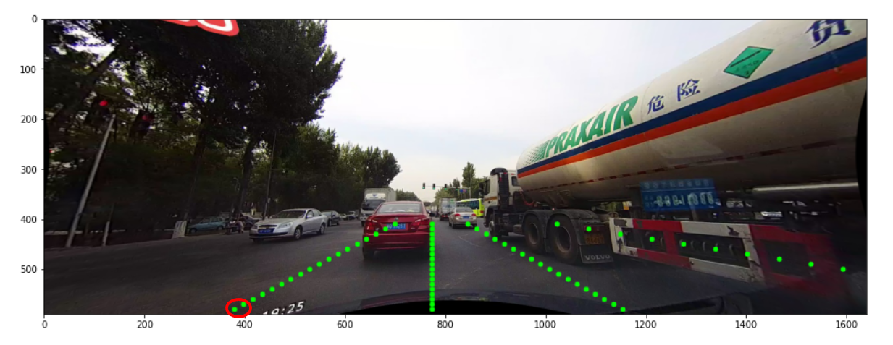
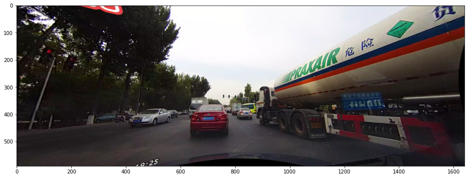
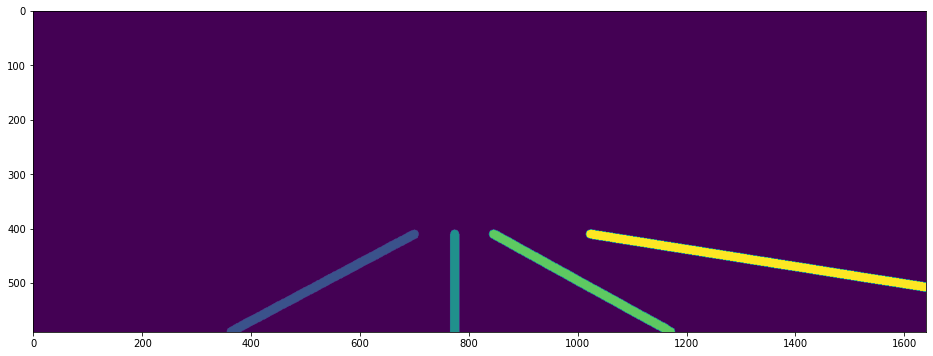

# Understanding CULane and UFLD for Annotation Tool Changes

The annotation tool only gives out segmentaiton masks (as polylines) from Segment Anything and
in COCO format. However, the UFLD will need simple segmention masks (which we can set as thin
rectangles which form the 'lane' in our case)

To understand what part of the annotation tool needs to change, the below learnings were
necessary.

# Understanding the CULane Dataset

## Keypoint Tasks

- For keypoint tasks, each image has a lines.txt file associated with it like 000.lines.txt
- Here each line of the lines.txt will contain the x,y coordinates of the keypoints
- For example, the first line of lines.txt may be ```362 590 380.01 580```
  - ```362, 590``` would be the x,y coordinate of the 1st keypoint of the 1st lane (bottom left of image)
  - ```380.01 580``` would be the 2nd keypoint of the 1st lane
  - Both the points are highlighted in image below:
  - 

## Segmentation tasks (what is required)

- For segmentation tasks, they have a train_gt.txt and a val_gt.txt in
  the dataset available online
- An excerpt from train_gt.txt will look like this:
  ```/driver_23_30frame/05151649_0422.MP4/00000.jpg /laneseg_label_w16/driver_23_30frame/05151649_0422.MP4/00000.png 1 1 1 1```
- If we were to index sections of the above line:
  - line[0] = image_path
  - line[1] = label_path

The image and label look like the following:

### Images



### Segmentation Labels

The below image is an artificially generated mask.



#### NOTE: The true images will look almost pitch black

This is because the lanes are labeled in such a way that the pixels belonging to lane line_1
will have pixel_value = 1, for lane line_2 they'll have pixel_value = 2 and so on.


## References:

1. https://www.kaggle.com/code/soumya9977/culane-dataset-visualization/notebook
2. https://xingangpan.github.io/projects/CULane.html


# Ultra Fast Lane Detection Configs

UFLD uses the CULane format but resizes the image to 288x800 during training. They accordingly
define some row anchors (which are discrete rows, i.e. indices in image.shape[0])

```
# row anchors are a series of pre-defined coordinates in image height to detect lanes
# the row anchors are defined according to the evaluation protocol of CULane and Tusimple
# since our method will resize the image to 288x800 for training, the row anchors are defined with the height of 288
# you can modify these row anchors according to your training image resolution

culane_row_anchor = [121, 131, 141, 150, 160, 170, 180, 189, 199, 209, 219, 228, 238, 248, 258, 267, 277, 287]
```

We can possibly modify this and possibly resize the image for training **(TBD)**

## Loading Data

The train.py in UFLD calls the dataloader class as shown below:

```python
train_loader, cls_num_per_lane = get_train_loader(cfg.batch_size, cfg.data_root, cfg.griding_num, cfg.dataset, cfg.use_aux, distributed, cfg.num_lanes)
```

The ```cfg``` mentioned above is obtained from configs/culane.py which contains below configs:

```python
# DATA
dataset='CULane'
data_root = None

# TRAIN
epoch = 50
batch_size = 32
optimizer = 'SGD'  #['SGD','Adam']
learning_rate = 0.1
weight_decay = 1e-4
momentum = 0.9

scheduler = 'multi' #['multi', 'cos']
steps = [25,38]
gamma  = 0.1
warmup = 'linear'
warmup_iters = 695

# NETWORK
use_aux = True
griding_num = 200
backbone = '18'

# LOSS
sim_loss_w = 0.0
shp_loss_w = 0.0

# EXP
note = ''

log_path = None

# FINETUNE or RESUME MODEL PATH
finetune = None
resume = None

# TEST
test_model = None
test_work_dir = None

num_lanes = 4
```

### Possible Param Changes
- We will work with 4 lanes for now and not change any settings
- griding_num should mean number of grid cells (yet to be verified). Again, can be left untouched for now


# Inference on Tool Changes Required

Since we'll be generating image masks, we can store the segmentation labels in COCO itself,
only will need to export it into label images later. (use helpers/convert_coco_ann_to_mask.py)

The tool changes necessary are:

1. Instead of calling Segment Anything, create a mode where we select two points and the
   tool automatically forms a rectangle around those two points
2. Since the tool throws all masks of size=4 (to not confuse with bboxes), we will need to
   artificially make the rectangle into a pentagon. Since we'll be converting to image masks
   later on, this should have no downstream effects.